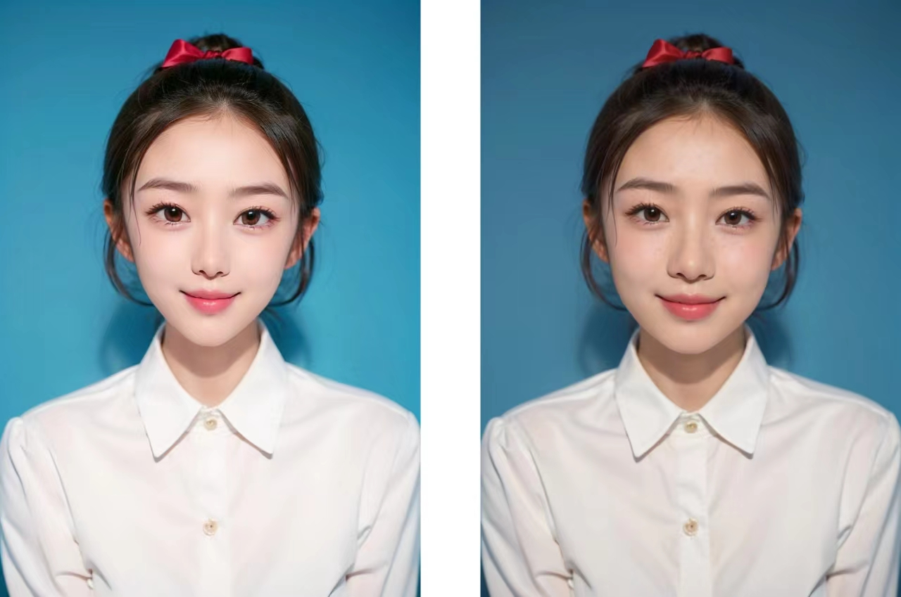

# PixelFree 使用文档

## 项目简介

**PixelFree** 是一款实时美颜 SDK 示例项目，集成了一键美颜、美肤、美型、滤镜和 2D 贴纸等功能。项目展示了如何通过集成第三方美颜引擎，实现在音视频场景下的实时图像增强与特效渲染，适合用于短视频、直播、视频通话等应用场景的快速接入与二次开发。

当前版本已适配主流音视频平台，包括：七牛云、声网（Agora）、腾讯云实时音视频（TRTC）、即构（Zego）。可作为各平台 SDK 的美颜插件独立接入使用。

---

**演示视频**

**演示图片** 

## 功能模块说明

### 一、美型类功能

| 功能名称 | 描述 |
|----------|------|
| 眼睛大小 | 调整眼睛的放大比例 |
| 瘦脸 | 调整脸部宽度，实现瘦脸效果 |
| 窄脸 | 控制脸部两侧的紧致程度，打造窄脸效果 |
| 下巴 | 调整下巴长度 |
| V脸 | 调整脸部轮廓，使脸型更接近 V 型 |
| 小脸 | 综合调节脸部大小 |
| 鼻子 | 调整鼻梁高度或宽度 |
| 额头 | 调整额头高度或宽度 |
| 嘴巴 | 调整嘴巴大小、形状 |
| 人中 | 调整人中（鼻子到嘴之间的距离） |
| 长鼻 | 延长或缩短鼻子长度 |
| 眼距 | 控制双眼之间的间距 |
| 微笑嘴角 | 增强嘴角上扬，增加笑容感 |
| 旋转眼睛 | 旋转眼睛角度，调整眼神方向 |
| 开眼角 | 调整眼角外扩程度，打造大眼效果 |

### 二、美肤类功能

| 功能名称 | 描述 |
|----------|------|
| 磨皮 | 平滑皮肤纹理，去除瑕疵 |
| 美白 | 提升肤色亮度，增强白皙效果 |
| 红润 | 增加肤色血色感，让皮肤更有生气 |
| 锐化 | 增强画面细节和轮廓清晰度 |
| 新美白算法 | 使用新版美白算法，提升自然度与肤质表现 |
| 画质增强 | 综合提升图像清晰度与通透感 |
| 亮眼 | 增亮眼部区域，突出眼神 |

### 三、滤镜功能

| 功能名称 | 描述 |
|----------|------|
| 滤镜类型 | 可切换多种风格滤镜，包括白亮、粉嫩、黑白、个性、冷色调、美白、暖色调、小清新、质感灰等 |

### 四、其他功能

| 功能名称 | 描述 |
|----------|------|
| 2D 贴纸 | 实时贴纸挂件，支持样式包括小白猫、小黄花、糖果、毛绒花朵、熊耳朵、熊猫等 |
| 一键美颜 | 预设美颜组合，一键切换所有美颜配置，包含自然、可爱、女神、白净等样式 |
| 水印 | 添加图像水印 |
| 扩展字段 | 用于扩展更多自定义美颜项 |

####  接入 pixelfree

[iOS 接入文档](./doc/ios_zh.md)

[android 接入文档](./doc/android_zh.md)

####  Android 体验 demo：https://www.pgyer.com/Cy9pG8

####  iOS 体验 demo ：https://testflight.apple.com/join/KWUMyqrh

#### Issue Feedback
- Email: [zhaobai851@gmail.com]
- WeChat: [Zhao0_ooo]

